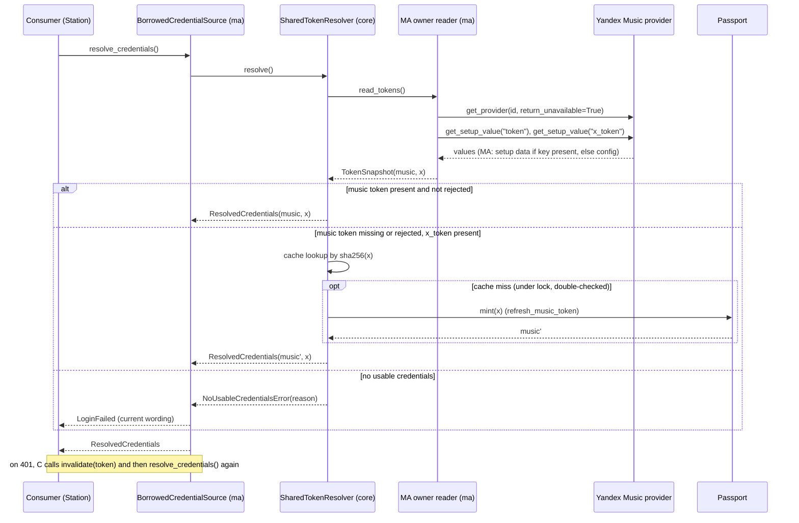

## Problem Statement

Several Yandex providers in Music Assistant use one Yandex account through a
linked Yandex Music instance (Station, Ynison, Alice, Smarthome). The Yandex
Music provider owns the account: it persists and rotates the tokens. The
others only borrow them.

Three problems follow from how borrowing works today.

1. **Stale tokens after rotation.** `BorrowedCredentialSource.read_tokens()`
   reads only the owner's legacy config (`owner.config.get_value`). Since MA
   2.10 the Yandex Music provider writes rotated tokens to setup data and reads
   them through `Provider.get_setup_value()`. On an upgraded install that still
   has an old token in its config, every borrower keeps using the stale token.
   Alice and Smarthome are affected today through the library directly.
2. **Diverging local adapters.** Station (`provider/borrow.py`) and Ynison
   (`provider/credential_source.py`) each work around (1) with their own
   adapter. The two copies use different precedence rules, and Station's copy
   still lets the legacy config win. A reviewer of the upstream Music Assistant
   PR #5605 asked for this logic to move into the library.
3. **Logic unavailable outside MA.** The read-only borrowing model (one owner
   rotates, borrowers mint music tokens in memory with a TTL cache, 401 storms
   coalesce into one Passport call) is independent of MA. It lives in
   `ya_passport_auth.ma` and depends on `music_assistant_models`, so Home
   Assistant integrations, CLI tools and multi-process services cannot reuse
   it.

A related inefficiency: borrowers need both tokens but can only get them with
two reads (`read_tokens()` for the x_token and `resolve_music_token()`, which
reads again). The two reads can observe different owner states.

## Solution Summary

Move the borrowing logic into a new framework-neutral core module
`ya_passport_auth.sharing`. The core takes credentials from an injected async
`CredentialReader` and mints music tokens through an injected callable. It has
no MA imports, and the pair it returns comes from one read.

`ya_passport_auth.ma.borrow` becomes a thin adapter:

- Its reader resolves the exact linked instance, validates domain and provider
  type, and reads both tokens through `owner.get_setup_value(key)`. Setup data
  wins when the key is present, including an explicit `None`. Otherwise MA
  falls back to config.
- The minimum supported Music Assistant version becomes **2.10.0** (the stable
  release, which has `Provider.get_setup_value` and pins
  `music-assistant-models==1.1.204`). The reader calls `get_setup_value`
  directly, with no `getattr` probe and no legacy `owner.config` path.
- `BorrowedCredentialSource` keeps its public API and adds
  `resolve_credentials()`.

Released as minor version 2.1.0. The public API is unchanged. The `ma` extra
raises its floor to `music-assistant-models>=1.1.204`, so pip refuses to
install 2.1.0[ma] next to an MA server older than 2.10.0 instead of failing at
runtime. Hosts older than 2.10.0 stay on 2.0.x.

## Acceptance Criteria

1. `import ya_passport_auth.sharing` succeeds with `music_assistant` and
   `music_assistant_models` blocked (extends `tests/ma/test_import_purity.py`).
   The module does not import `ya_passport_auth.ma`.
2. `SharedTokenResolver.resolve()` calls the reader **exactly once** and returns
   `ResolvedCredentials(music_token, x_token)` built from that single snapshot.
   When it mints, it mints from the x_token of that same snapshot.
3. The resolver keeps today's semantics, now covered by core tests without MA:
   - the persisted music token is preferred unless it was rejected;
   - the cache is keyed by SHA-256 of the x_token, with TTL 50 min and LRU
     eviction at 4 entries;
   - at most 4 rejected hashes are remembered, and an owner rotation clears a
     rejection;
   - concurrent callers coalesce into one mint, and a failed mint is not
     cached;
   - `invalidate()` accepts a `str` or a `SecretStr`.
4. Mint exceptions propagate unchanged from the injected `mint` callable. The
   default mint (`PassportClient.refresh_music_token`) raises only
   `YaPassportError` subclasses. `asyncio.CancelledError` is never swallowed.
5. The core raises `NoUsableCredentialsError` (subclass of `AuthFailedError`)
   in two cases: the snapshot holds no tokens, or it holds only a rejected
   music token and no x_token. The `reason` attribute distinguishes the two.
   Neither the message nor the attributes ever contain token material.
6. With an owner that implements `get_setup_value`, the MA reader matches the
   storage matrix below. The cases use synthetic values and MA's real
   precedence contract:

   | Setup data | Legacy config | `read_tokens()` returns |
   | --- | --- | --- |
   | new pair | old pair | new pair |
   | new pair | old x_token only | new pair |
   | explicit `None` for both keys | old pair | `(None, None)` |
   | keys absent | old pair | old pair |
   | new x_token only, music key absent | old pair | `(old music, new x)` |

7. The reader never reads `owner.config` directly and contains no
   `getattr`/`callable` probe for `get_setup_value`. The `ma` extra in
   `pyproject.toml` requires `music-assistant-models>=1.1.204`, and the README
   states "Music Assistant 2.10.0 or newer" for the `ma` extra. The fake owner
   in `tests/ma/test_borrow.py` gains `get_setup_value` (MA contract) in place
   of `config.get_value`. The commit message explains the change (support
   floor raised to MA 2.10.0). The test bodies and assertions of the 27
   existing tests stay unchanged.
8. Owner resolution is unchanged: exact instance via
   `get_provider(id, return_unavailable=True)`, never falling back to another
   instance. A missing owner raises `ResourceTemporarilyUnavailable`. A wrong
   domain or type raises `LoginFailed`. Messages keep their current wording.
9. `BorrowedCredentialSource` keeps its signature and methods (`__init__`
   kwargs, sync `read_tokens()`, `resolve_music_token()`, `invalidate()`) and
   gains `async resolve_credentials() -> ResolvedCredentials`, which reads the
   owner exactly once. `NoUsableCredentialsError` maps to `LoginFailed` with
   the current messages, including the instance id.
10. Public exports:
    - `ya_passport_auth` adds `SharedTokenResolver`, `CredentialReader`,
      `TokenSnapshot`, `ResolvedCredentials`, `NoUsableCredentialsError` and
      `CredentialSourceUnavailableError`;
    - `ya_passport_auth.ma` adds `ResolvedCredentials` as a re-export;
    - no existing export is removed or renamed.
11. Coverage stays at or above the 95% gate. `mypy --strict`, ruff and bandit
    pass. `CHANGELOG.md` gets a `## [2.1.0]` entry under `Added`, `Changed`
    (MA 2.10.0 minimum, models floor) and `Fixed`.

## Test Plan

Each test is written first, and its failure is confirmed before the
implementation.

- `tests/unit/test_sharing.py` (new, no MA imports): a fake async reader with
  a call counter and an injected mint with a call log. It covers criteria 2–5
  and includes:
  - `test_resolve_reads_once`;
  - `test_resolve_mints_from_same_snapshot`, where the reader returns
    different pairs on consecutive calls;
  - `test_mint_errors_propagate_unchanged` (`NetworkError`,
    `InvalidCredentialsError`);
  - `test_cancellation_propagates_from_mint`;
  - `test_no_usable_credentials_reasons`;
  - `test_error_messages_contain_no_token_material`.
- Port the cache, LRU, rejection and coalescing behaviour tests from
  `tests/ma/test_borrow.py` to the core level, against the core API. Keep the
  MA copies as adapter regression tests.
- `tests/ma/test_borrow_setup_data.py` (new): `_Owner` variants implementing
  `get_setup_value` with MA's documented contract (setup data when the key is
  present, otherwise config). The fake cites
  `music_assistant/models/provider.py` `Provider.get_setup_value`. Covers the
  criterion 6 matrix, `SecretStr` and empty-string normalisation, and custom
  key names.
- `tests/ma/test_borrow.py`: only the `_Owner` fake changes (criterion 7); the
  test bodies guard criterion 8 and the adapter regressions. Add
  `test_resolve_credentials_single_read` (spy on the owner read) and
  `test_resolve_credentials_maps_no_credentials`.
- `tests/ma/test_import_purity.py`: add `ya_passport_auth.sharing` to the
  blocked-imports probe.
- Contract check against the real MA API happens in consumer repos, not here.
  The library cannot depend on the MA server. The Station adoption PR runs its
  borrow tests in an `ma-server` checkout with the real
  `Provider.get_setup_value` (follow-up below).

## Sequence Diagram



## Data Model

New, in `ya_passport_auth/sharing.py` (re-exported from `ya_passport_auth`):

```python
@dataclass(frozen=True, slots=True)
class TokenSnapshot:
    """One read of the owner's persisted tokens."""
    music_token: SecretStr | None
    x_token: SecretStr | None

@dataclass(frozen=True, slots=True)
class ResolvedCredentials:
    """A usable music token plus the x_token it is consistent with."""
    music_token: SecretStr
    x_token: SecretStr | None

class CredentialReader(Protocol):
    async def read_tokens(self) -> TokenSnapshot: ...

MintMusicToken = Callable[[SecretStr], Awaitable[SecretStr]]

class SharedTokenResolver:
    def __init__(
        self,
        reader: CredentialReader,
        *,
        mint: MintMusicToken | None = None,   # default: PassportClient.refresh_music_token
        ttl_s: float = MUSIC_TOKEN_TTL_S,
        now: Callable[[], float] = time.monotonic,
    ) -> None: ...
    async def resolve(self) -> ResolvedCredentials: ...
    async def resolve_music_token(self) -> SecretStr: ...   # delegates to resolve()
    def invalidate(self, token: str | SecretStr) -> None: ...
```

New exceptions in `ya_passport_auth/exceptions.py`:

| Class | Base | Meaning |
| --- | --- | --- |
| `CredentialSourceUnavailableError` | `YaPassportError` | Transient: the owner is not readable yet. Non-MA readers raise it; the MA reader keeps raising `ResourceTemporarilyUnavailable`. |
| `NoUsableCredentialsError` | `AuthFailedError` | Terminal. `reason: Literal["no_credentials", "rejected_without_x_token"]`. |

Changed: `ya_passport_auth.ma.borrow`.

- `BorrowedCredentialSource` composes `SharedTokenResolver` with an internal
  `_LinkedOwnerReader`. Its public API is unchanged, plus the new
  `resolve_credentials()`.
- The reader reads only through `owner.get_setup_value(key)` (MA 2.10.0+).
- The default mint in the adapter stays `ma.tokens.refresh_music_token`,
  looked up at call time. It keeps the MA error mapping and existing test
  monkeypatching.
- `_secret_or_none` and the cache, rejection and lock internals move to the
  core. The adapter keeps no copies.

Unchanged: `BORROW_SOURCE_OWN`, `list_yandex_music_instances`,
`MUSIC_TOKEN_TTL_S` (re-exported from core), `CredentialCascade`, `tokens`,
`flow`, `errors`.

## Design Decisions

- **Async reader protocol.** Non-MA stores (files, keyring, databases, secret
  managers) are often async. The MA adapter offers a sync `read_tokens()` for
  existing callers and implements the async protocol for the core. A
  sync-or-async protocol was rejected because it complicates typing under
  `mypy --strict`.
- **Injected mint callable instead of a client.** It is easier to test, lets
  callers reuse one aiohttp session through a closure, and lets the MA adapter
  keep its error mapping without the core knowing about MA.
- **No storage precedence in the core.** The host that owns the store defines
  which source wins (MA: setup data, then config). An `or`-chain in the
  library would mishandle explicit clearing.
- **MA 2.10.0 is the minimum; there is no compatibility fallback.** Stable
  2.10.x (current 2.10.5) ships setup data and `get_setup_value`, and the
  owner (Yandex Music) persists credentials there. A legacy-config path would
  be dead code on supported hosts and a second precedence rule to keep
  correct. The floor is enforced at install time through the models pin. That
  is a proxy, because models and server are released separately, but MA
  server pins models exactly, so an older server cannot co-install. Providers
  drop their `getattr` checks (PR #5605 review).

## Out of Scope / Follow-ups

- **0002:** move `CredentialCascade` into the core with a store protocol and a
  public `classify_failure()` policy. `ma.cascade` and `ma.errors` become thin.
- **0003:** core `parse_cookie_input()`, so `ma.flow.login_with_cookies`
  becomes a thin wrapper.
- **Consumer adoption, tracked in each repo:**
  - Station: delete `provider/borrow.py`, use `resolve_credentials()`,
    simplify the startup wait (PR #5605 threads 1–3 and 9).
  - Ynison: delete `provider/credential_source.py`.
  - Alice: pin bump only.
  - Smarthome: migrate from 1.7.0 (replace `run_device_flow`).
  - Music: align its pin with `requirements_all.txt`.
  - All pins and `requirements_all.txt` move to 2.1.0 together.
  - Each standalone provider repo declares MA 2.10.0 as its minimum supported
    version (README, test matrix in `ma-provider-tools`). It removes
    compatibility shims for older MA, for example Station's announcement
    `hasattr` branch (PR #5605 thread 8).
